# CivicShield

**Know what they can do. Know what you can do.**

CivicShield turns confusing legal documents (leases, termination notices, purchase agreements)
into plain-language explanations, evidence-backed findings, and a concrete next-step plan.

> Informational guidance, not legal representation. Not a substitute for professional legal
> advice.

**Verticals:** TenantShield (housing) · WorkShield (employment) · ConsumerShield (consumer)

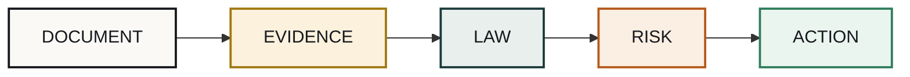

## Getting started

```bash
npm install
npm run dev      # http://localhost:3000
npm run build    # production build
npm run lint
```

`/demo` for instant precomputed analyses (no upload needed) · `/analyze` to upload a real
PDF/DOCX/TXT (10 MB limit).

## Pipeline

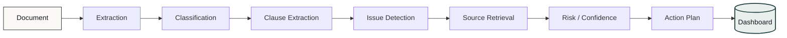

## User journey

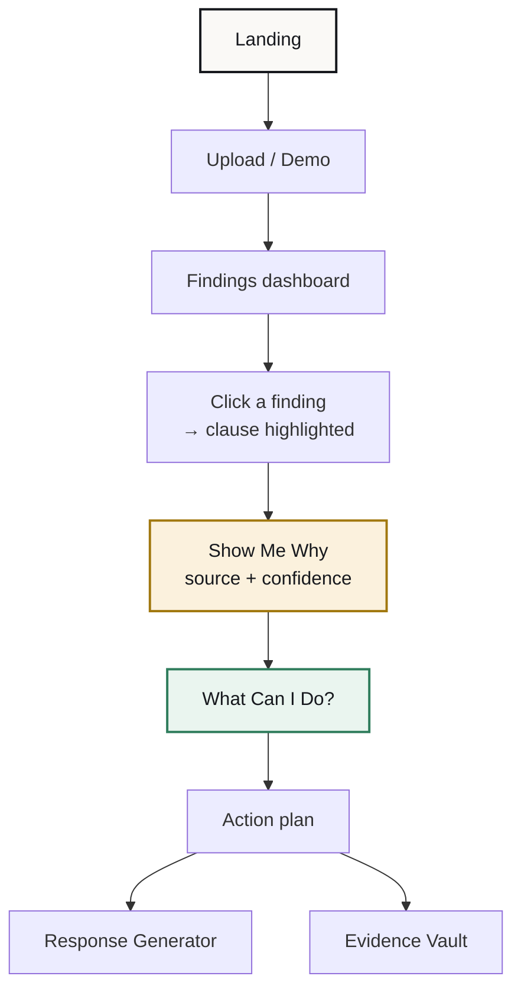

## Verticals

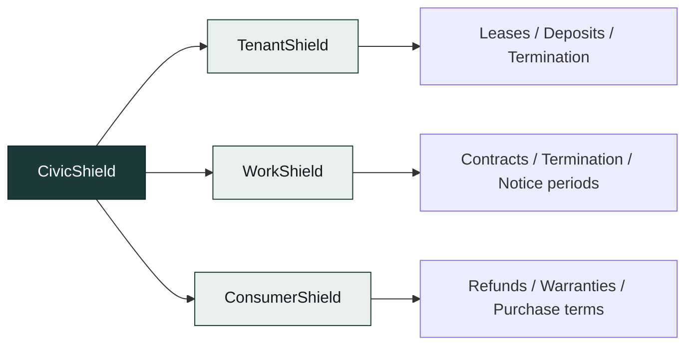

All three run the same pipeline and components — see the [feature matrix](#feature-matrix).

## TenantShield demo results

Real output from `/api/demo/tenant` on the fictional sample lease — **demo data, not a
real-world statistic**.

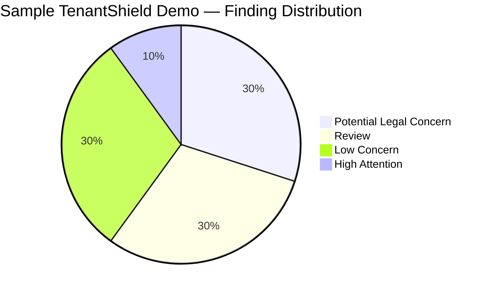

| Risk level | Count |
|---|---|
| 🔴 Potential Legal Concern | 3 |
| 🟠 High Attention | 1 |
| 🟡 Review | 3 |
| 🟢 Low Concern | 3 |
| **Total** | **10** |

<a id="feature-matrix"></a>

## Feature matrix

| Feature | TenantShield | WorkShield | ConsumerShield |
|---|---|---|---|
| Document analysis | ✅ | ✅ | ✅ |
| Clause detection | ✅ | ✅ | ✅ |
| Risk classification | ✅ | ✅ | ✅ |
| Show Me Why | ✅ | ✅ | ✅ |
| Legal source retrieval | ✅ | ✅ | ✅ |
| Document highlighting | ✅ | ✅ | ✅ |
| Action Plan | ✅ | ✅ | ✅ |
| Response Generator | ✅ | ✅ | ✅ |
| Scenario Simulator | ✅ | ✅ | ✅ |
| Evidence Vault | ✅ | ✅ | ✅ |

## Architecture

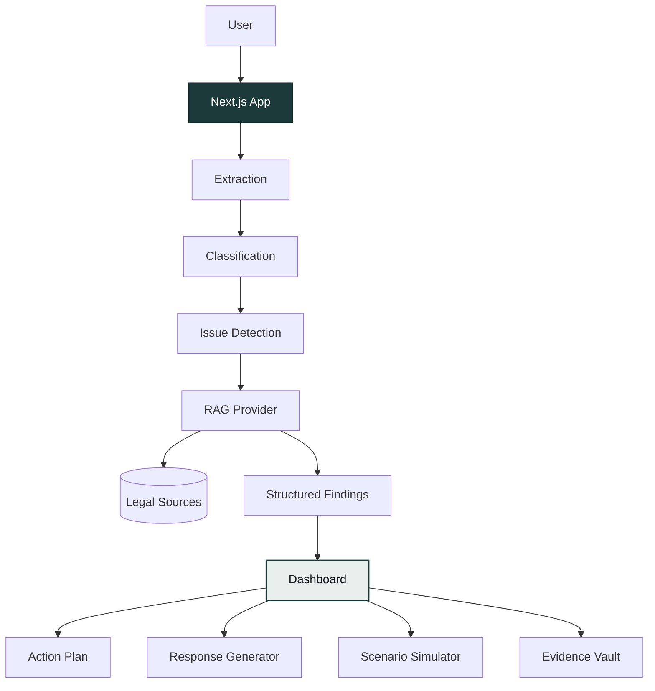

## Legal source retrieval

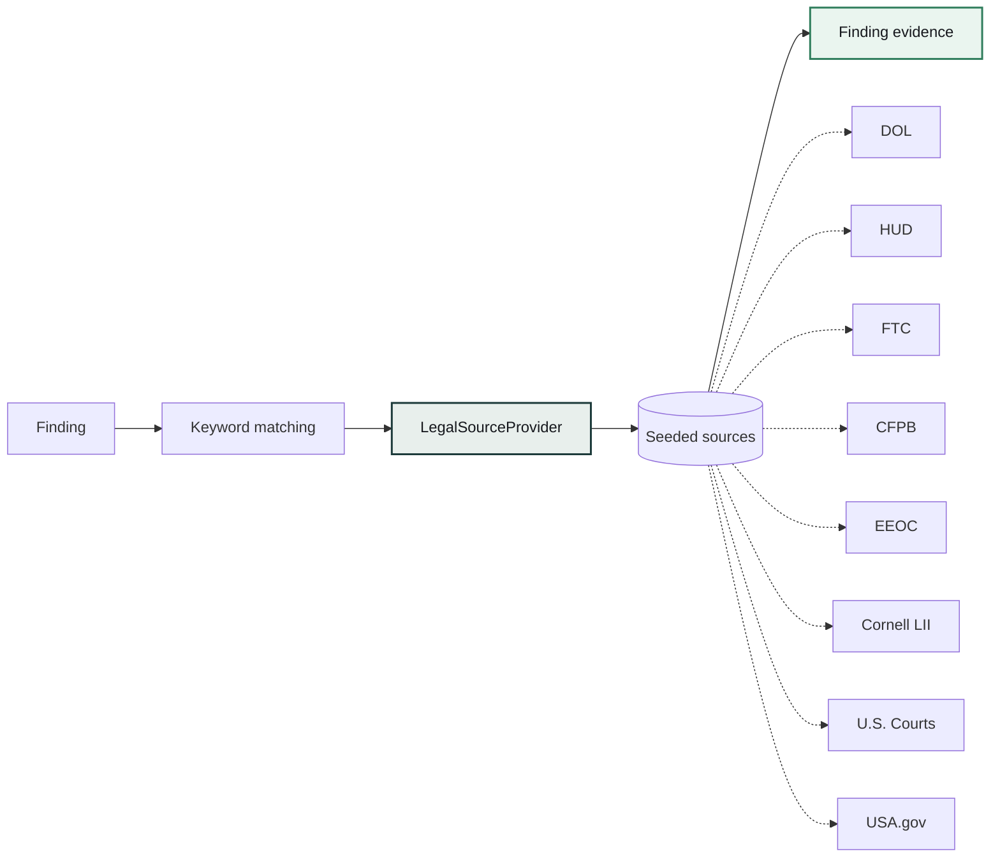

Federal-level, hand-curated, real government URLs only. Not exhaustive. No source match →
"Source verification unavailable" instead of a guess.

## Deterministic today, LLM-ready tomorrow

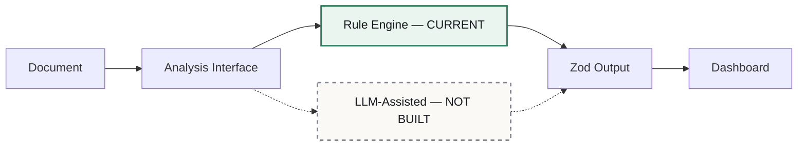

No external AI calls today — fully rule-based, zero hallucination risk, works offline. The dashed
path is a future option, not implemented.

## Core features

**Show Me Why** — clause → source → reasoning → confidence, always traceable.

**Action Plan**

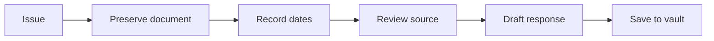

**Response Generator**

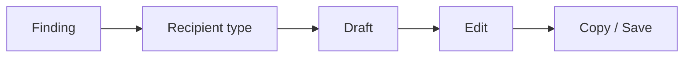

**Scenario Simulator** — "What happens if...?" as a decision tree. Explorations, not guarantees.

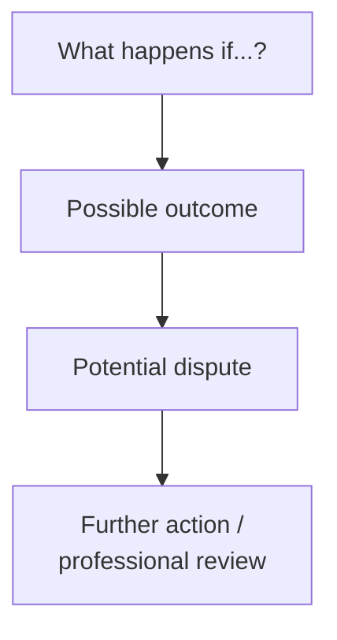

**Evidence Vault** — save findings/responses/notes to localStorage.

## Privacy

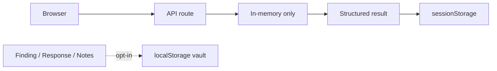

No backend database. Uploaded files are never persisted — processed in-memory per request only.

## Tech stack

Next.js 16 · React 19 · TypeScript · Tailwind v4 · Zod · `pdf-parse` · `mammoth` · `lucide-react`

No external AI API, no API keys required.

## Limitations

- Rule-based detection, not an LLM — misses nuance outside the seeded rules/sources.
- Federal-level sources only; state/local law not modeled.
- No auth or multi-user persistence.
- No OCR for scanned/image-only PDFs.

## Roadmap

- Optional LLM-assisted analysis behind the same interface + schemas.
- Embeddings/pgvector-backed source retrieval.
- State/local jurisdiction sources.
- OCR for scanned PDFs.
