# CivicShield

**Know what they can do. Know what you can do.**

CivicShield is an AI-powered legal/civic rights navigator built for **LexHack 2026**. It helps
ordinary people understand confusing legal and official documents by identifying important
clauses, explaining them in plain language, grounding findings in verified legal sources, and
turning that understanding into a concrete next-step plan.

> CivicShield provides informational guidance, not legal representation. It is a first layer of
> legal understanding and action planning -- not a substitute for professional legal advice.

## The problem

Most people who receive a lease, a termination notice, or a purchase agreement don't need a
lawyer to read it -- they need help understanding it well enough to know if something is worth
questioning, and what to do next. CivicShield is that first layer.

## Core philosophy

CivicShield is built around one pipeline, applied consistently to every document:

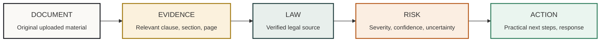

| Stage | What it means in CivicShield |
|---|---|
| **DOCUMENT** | The original uploaded material -- unmodified, never persisted server-side. |
| **EVIDENCE** | The exact clause the finding is based on, with section/page reference where available. |
| **LAW** | A verified legal source -- a real government URL, or an explicit "source verification unavailable." |
| **RISK** | A severity label, a calibrated confidence score, and explicit uncertainty framing. |
| **ACTION** | A concrete next-step plan and, optionally, a drafted written response. |

Three MVP verticals: **TenantShield** (housing), **WorkShield** (employment), **ConsumerShield**
(consumer disputes). The architecture is extensible to more domains.

## Getting started

```bash
npm install
npm run dev
```

Visit `http://localhost:3000`. Try `/demo` for three instant, precomputed analyses that require
no upload (TenantShield, WorkShield, ConsumerShield), or `/analyze` to upload a real PDF/DOCX/TXT
document (10 MB limit).

```bash
npm run build   # production build
npm run lint    # eslint
```

---

## 📊 Project Visualizations

Every diagram below reflects the actual implementation in this repository -- component names,
module paths, and data values are taken directly from the codebase and the live TenantShield demo
API response (`/api/demo/tenant`), not invented. Where a number is shown, it is real demo/sample
data and is labeled as such.

### 1. End-to-end analysis pipeline

How a document moves from upload to dashboard. Each stage maps to a real module in `src/lib`.

```mermaid
flowchart LR
    D[Document] --> EX[Extraction<br/><sub>lib/document/extract-text.ts</sub>]
    EX --> CL[Classification<br/><sub>lib/legal/classify.ts</sub>]
    CL --> CE[Clause / Claim<br/>Extraction<br/><sub>lib/document/structure.ts</sub>]
    CE --> ID[Legal Issue<br/>Detection<br/><sub>lib/legal/detect-issues.ts</sub>]
    ID --> SR[Legal Source<br/>Retrieval<br/><sub>lib/rag</sub>]
    SR --> SG[Source-Grounded<br/>Analysis]
    SG --> RC[Risk /<br/>Confidence]
    RC --> EM[Evidence<br/>Mapping]
    EM --> AP[Action Plan<br/><sub>lib/ai/action-plan.ts</sub>]
    AP --> DB[(Dashboard)]

    style D fill:#faf9f6,stroke:#16181d
    style DB fill:#e8efec,stroke:#1c3a3a,stroke-width:2px
```

### 2. Product / user journey

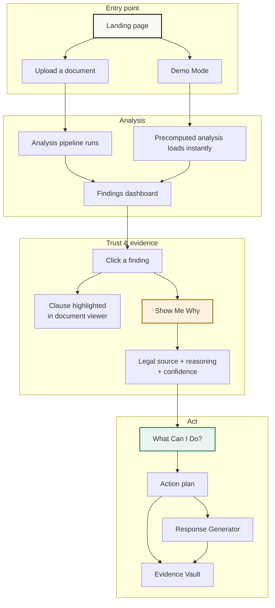

### 3. Product verticals

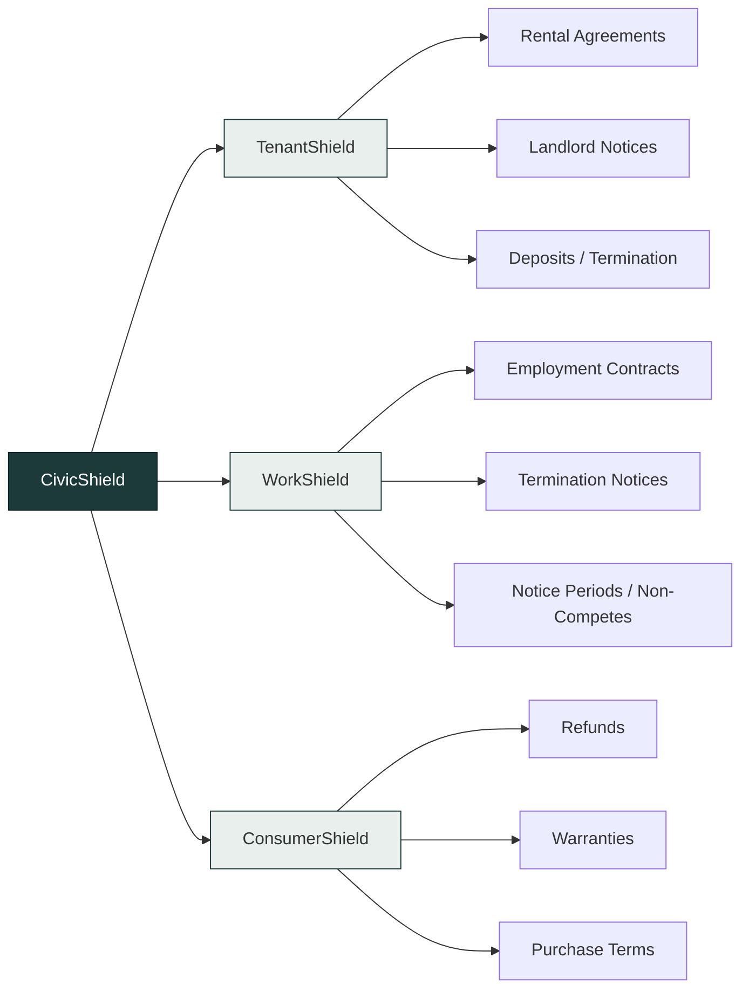

All three verticals run through the identical pipeline, action plan engine, response generator,
and scenario simulator -- see the [feature coverage matrix](#feature-coverage) below.

### 4 & 5. Sample TenantShield demo — finding distribution

The precomputed TenantShield demo (`/api/demo/tenant`, backed by the fictional sample lease in
`src/data/demo/documents.ts`) currently produces **10 findings** across 12 extracted clauses. This
is real output from the current rule engine on one fixed sample document -- **not** a statistic
about real-world leases, legal outcomes, or CivicShield's accuracy in general.

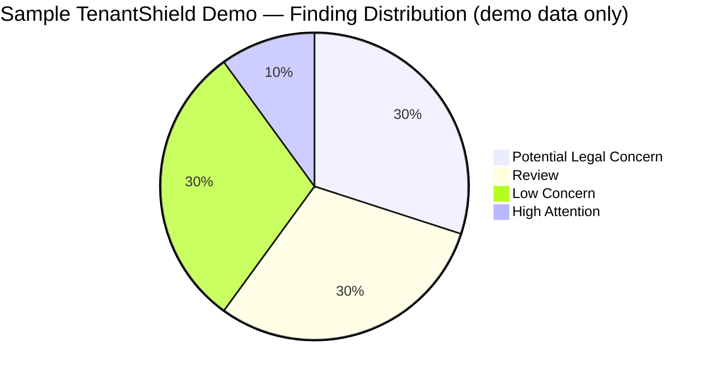

"TenantShield Demo Findings by Risk Level" (demo data only) -- rendered as a Markdown table since
Mermaid's `xychart-beta` bar-chart support on GitHub is not reliably guaranteed, per the same 10
findings shown in the pie chart above:

| Risk level | Count (demo) | |
|---|---|---|
| 🔴 Potential Legal Concern | 3 | `███` |
| 🟠 High Attention | 1 | `█` |
| 🟡 Review | 3 | `███` |
| 🟢 Low Concern | 3 | `███` |
| **Total findings** | **10** | |

<a id="feature-coverage"></a>

### 6. Feature coverage matrix

What actually exists in the current implementation, per vertical. All three verticals share the
same underlying pipeline and components (`src/lib`, `src/components/dashboard`) -- there is no
vertical-specific gating in the code, so coverage is identical across columns today.

| Feature | TenantShield | WorkShield | ConsumerShield |
|---|---|---|---|
| Document analysis | ✅ | ✅ | ✅ |
| Clause detection | ✅ | ✅ | ✅ |
| Risk classification | ✅ | ✅ | ✅ |
| Show Me Why | ✅ | ✅ | ✅ |
| Legal source retrieval | ✅ | ✅ | ✅ |
| Document highlighting | ✅ | ✅ | ✅ |
| Action Plan | ✅ | ✅ | ✅ |
| Response Generator | ✅ | ✅ | ✅ |
| Scenario Simulator | ✅ | ✅ | ✅ |
| Evidence Vault | ✅ | ✅ | ✅ |

### 7. Architecture

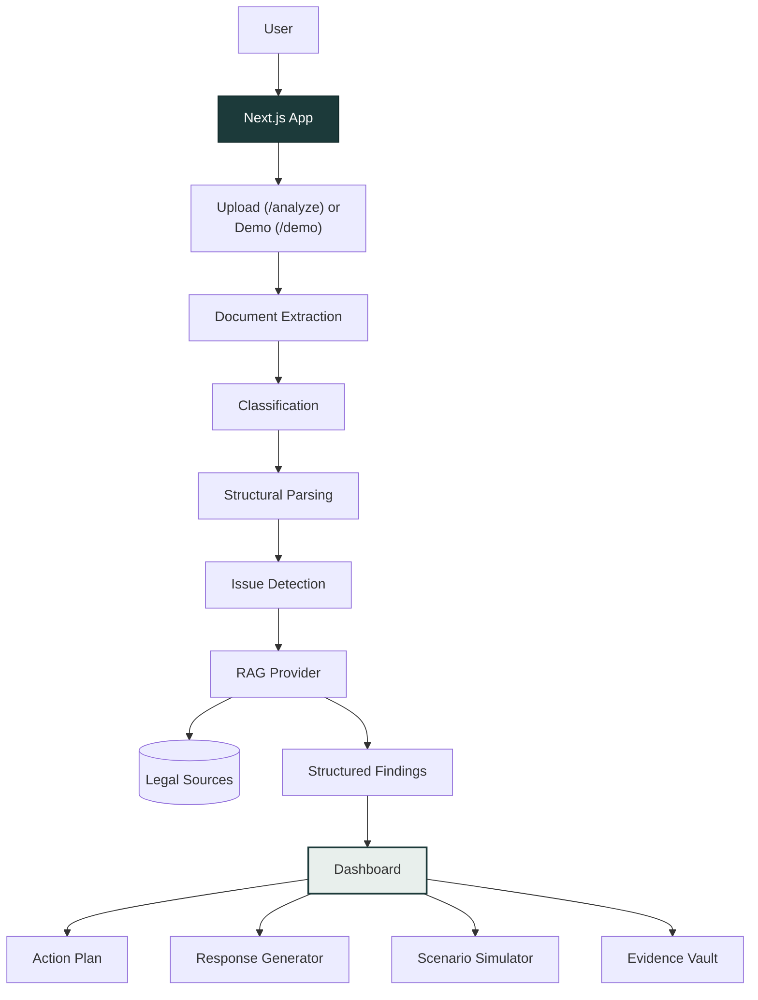

### 8. Legal source retrieval

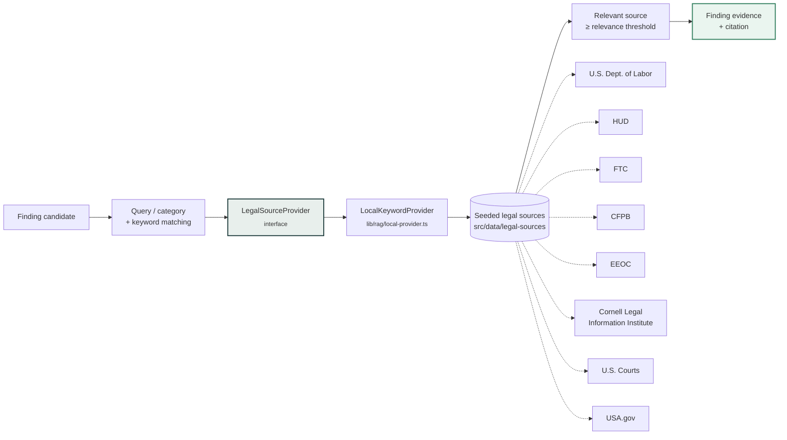

These sources are a hand-curated, federal-level starting set for the hackathon demo -- they do
**not** cover all laws or jurisdictions. If no seeded source clears the relevance threshold for a
clause, CivicShield shows an explicit "Source verification unavailable" rather than guessing.

### 9. Deterministic today, LLM-ready tomorrow

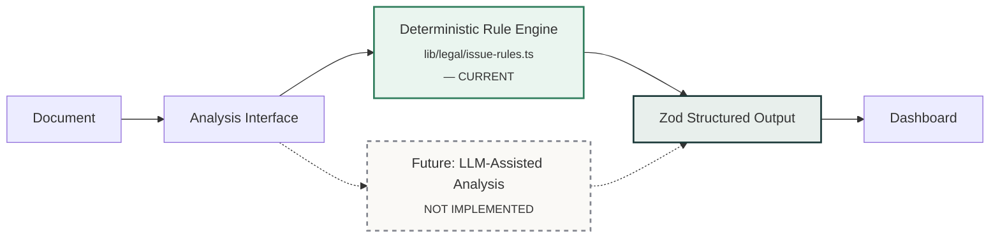

The dashed node and edges mark the **only** part of this diagram that does not exist yet. Today,
every finding comes from the deterministic rule engine; an LLM-assisted pass could later plug into
the same `Analysis Interface` and produce the same validated `Finding` shape, without touching the
dashboard or any downstream component.

## Key features

- **Show Me Why**: every finding traces back to the original clause (with section/page), the
  matched legal source, the AI's reasoning trail, and a calibrated confidence score.
- **Split-screen document viewer**: clicking a finding highlights the source clause in the
  document (desktop split-screen; stacked on mobile).
- **AI safety layer**: uncertainty detection, citation requirements, fact-vs-inference display,
  confidence scores, and escalation-to-professional-review framing throughout.

### Action Plan

Category-specific, checkable next steps -- not just "consult a lawyer."

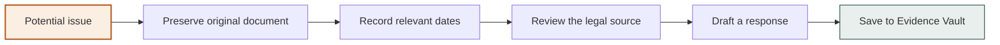

### Response Generator

Template-based professional response drafts, factual and editable, clearly separating
user-supplied facts from AI-generated language.

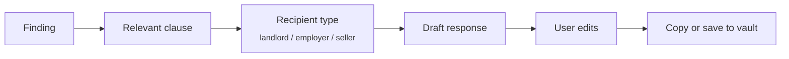

### Scenario Simulator ("What happens if...?")

A decision-tree answer distinguishing known facts, possible outcomes, and uncertainty -- these are
scenario explorations, **not guaranteed legal predictions**.

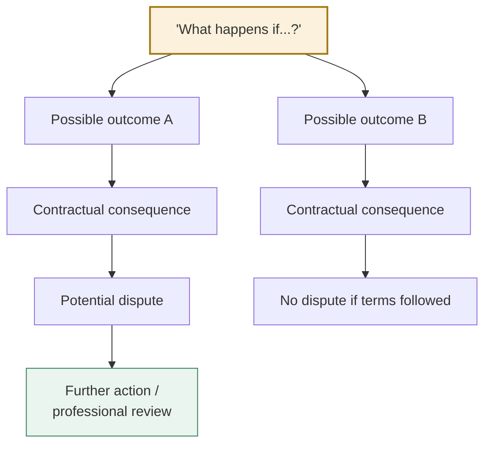

### Evidence Vault

Client-side (localStorage) space to save clauses, responses, and notes.

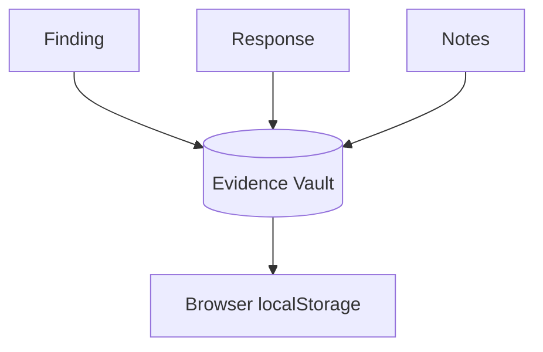

## Tech stack & disclosures

- **Framework**: Next.js 16 (App Router, Turbopack), React 19, TypeScript.
- **Styling**: Tailwind CSS v4, custom civic/legal-tech design tokens (no component library).
- **Validation**: Zod for all structured AI output.
- **Document parsing**: `pdf-parse` (PDF), `mammoth` (DOCX), native text for `.txt`.
- **Icons**: `lucide-react`.
- **No external AI API is called in this build** -- the pipeline is deterministic and rule-based
  (see diagram 9 above). No API keys are required or stored.
- **Storage**: no backend database in this MVP. Uploaded files are processed in-memory for a
  single request and are not persisted. Analysis results live in `sessionStorage` (per tab, per
  session); Evidence Vault entries live in `localStorage` (until the user clears them).
- **Legal sources**: real government URLs, seeded and hand-verified (see
  `src/data/legal-sources/index.ts`). Not exhaustive, and not a substitute for jurisdiction-
  specific legal research.

## Privacy & data flow

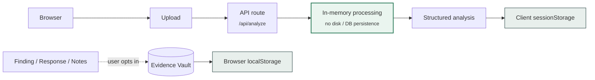

- Documents are validated (type, size) before processing and are not logged or persisted
  server-side.
- All analysis happens server-side (API routes); no document content or key material is exposed
  to the client beyond the structured analysis result.
- Uploaded documents are **not stored in a backend database** -- nothing persists once the
  request completes, aside from what the browser itself holds in `sessionStorage`/`localStorage`.
- The upload page displays an explicit notice about sensitive information before any file leaves
  the browser.

## Project structure

```
src/
  app/            routes: /, /analyze, /demo, /vault, /dashboard/[id], /api/*
  components/     upload, dashboard, layout, ui primitives
  lib/
    ai/           schemas, action plan, response generator, scenario simulator, pipeline
    document/     text extraction + structural parsing
    legal/        clause classification + issue detection rules
    rag/          retrieval abstraction + seeded provider
    validation/   upload validation + sanitization
    client/       browser-only stores (analysis cache, vault, ids)
  types/          shared domain types
  data/
    demo/         fictional demo documents + precomputed analyses
    legal-sources/ seeded, verified legal source records
```

## Known limitations (hackathon scope)

- Clause classification/issue detection is rule-based, not an LLM -- broader legal nuance beyond
  the seeded rules and sources will not be detected.
- Legal sources are federal-level and illustrative; state/local law varies and is not modeled.
- No authentication or multi-user persistence; Evidence Vault is local to one browser.
- Scanned/image-only PDFs (no embedded text layer) are not OCR'd.

## Future roadmap

- Optional LLM-assisted analysis pass behind the same `Analysis Interface` (see diagram 9), with
  retry/repair against the existing Zod schemas.
- Embeddings/pgvector-backed `LegalSourceProvider` for broader, semantic source retrieval.
- State/local jurisdiction-aware legal source sets.
- OCR support for scanned/image-only PDFs.
